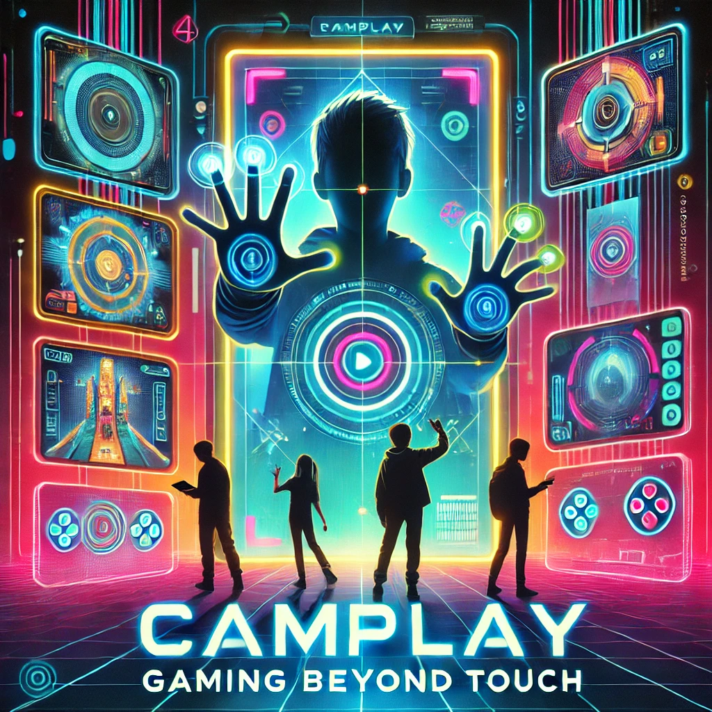
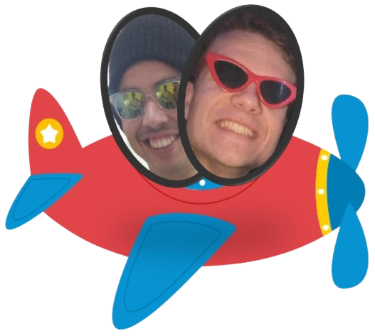
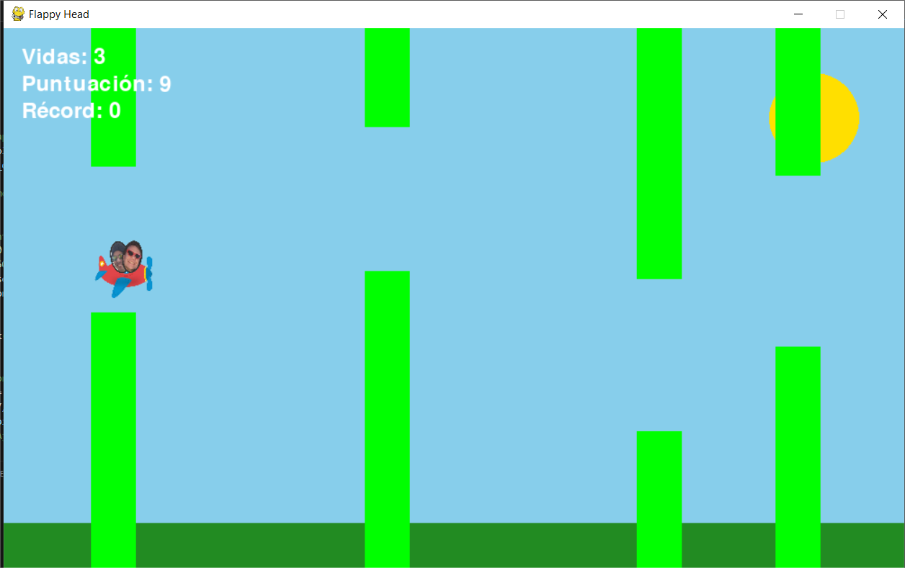
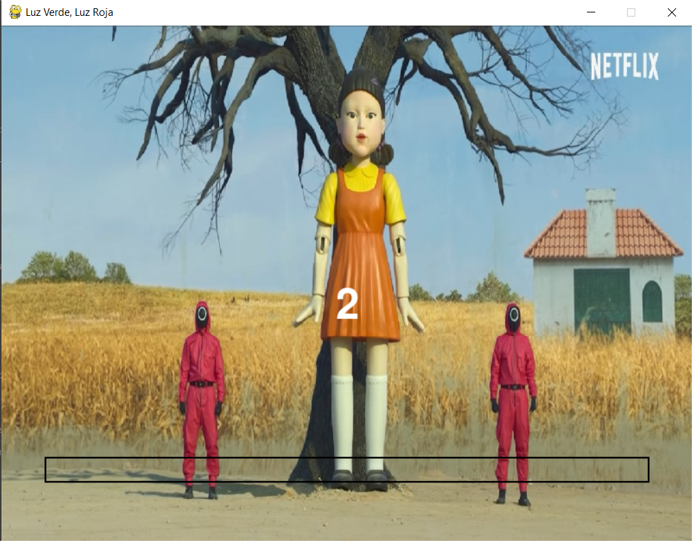
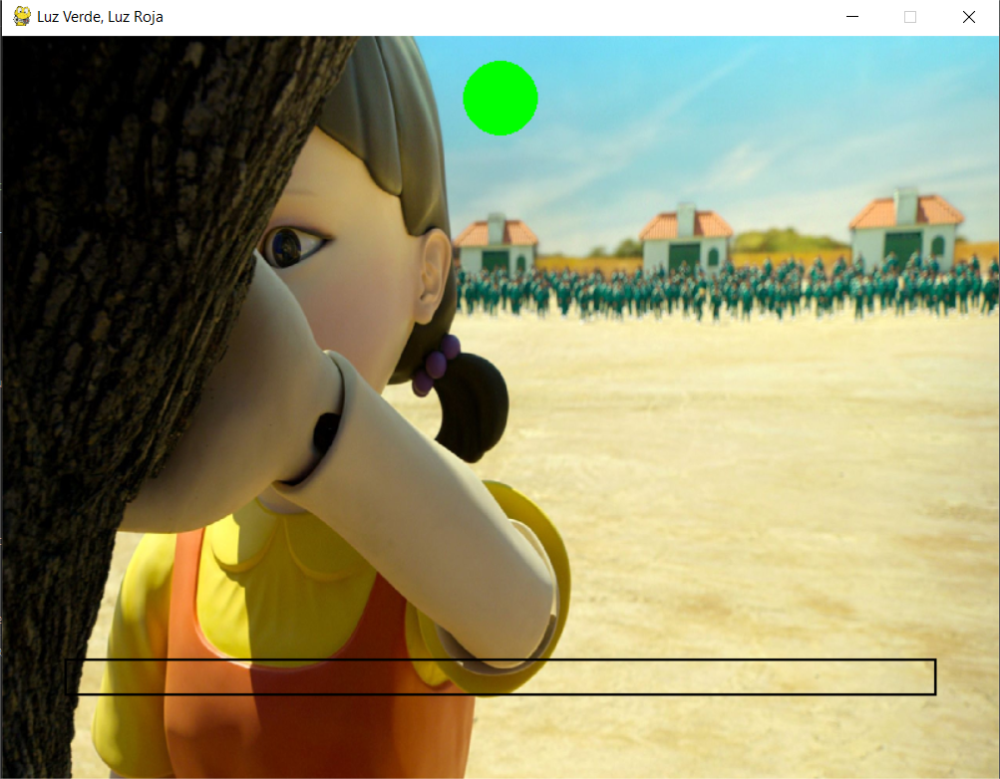
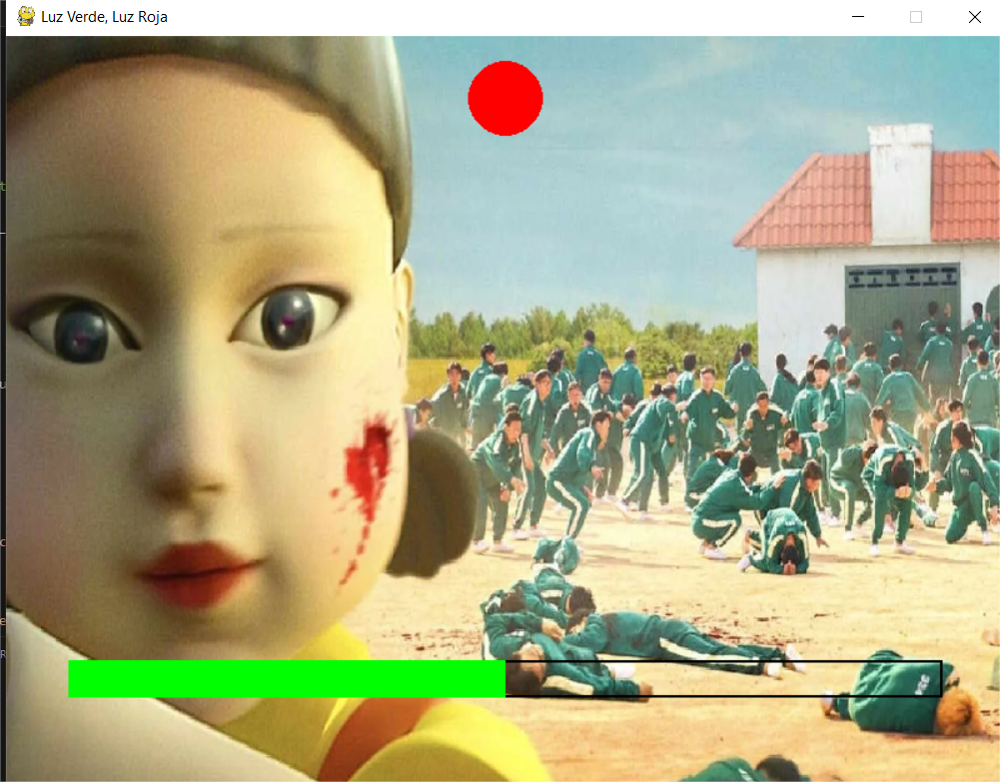
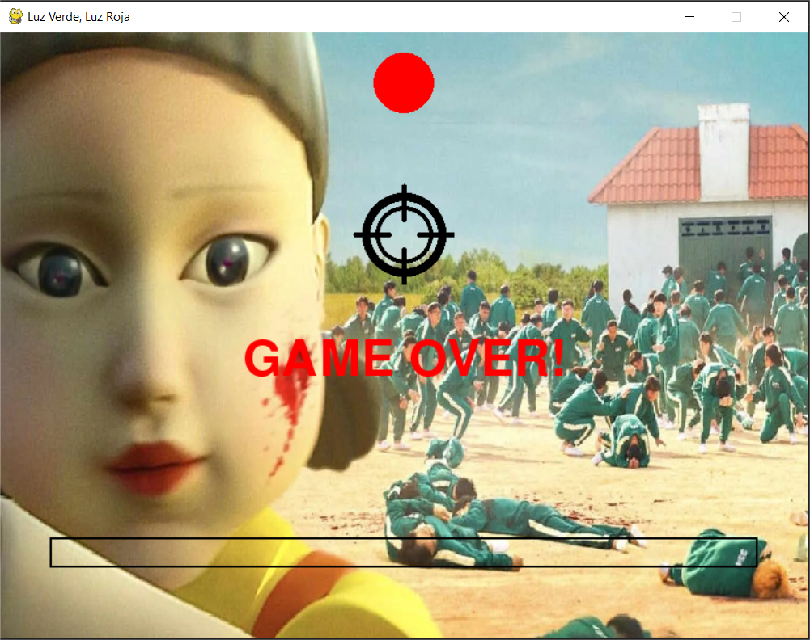
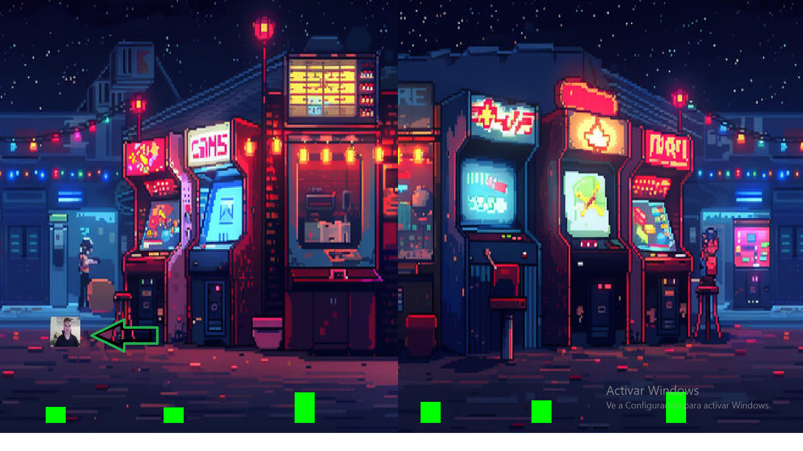
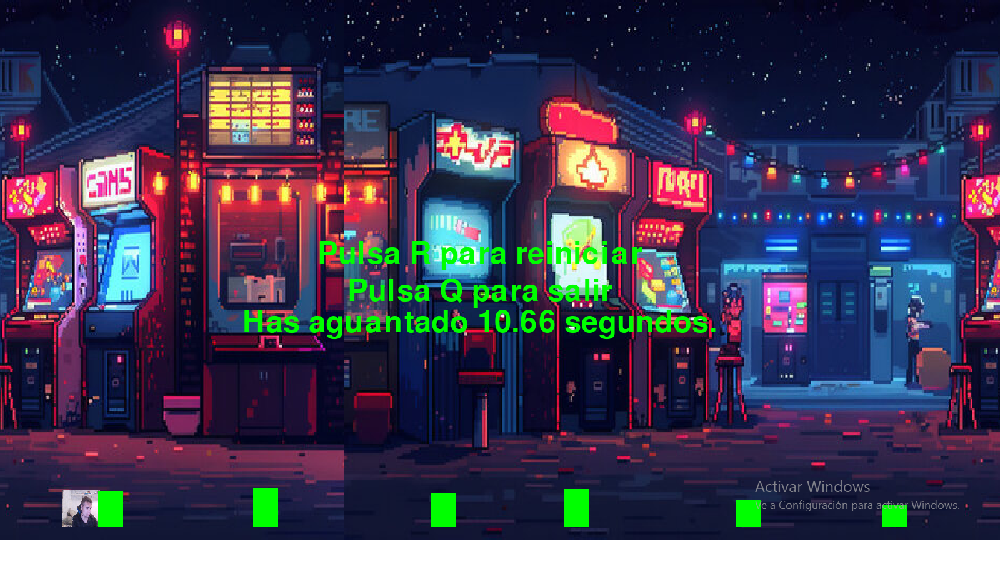

## Índice

1. [Motivación y Argumentación del Trabajo](#motivación-y-argumentación-del-trabajo)
2. [Objetivo de la Propuesta](#objetivo-de-la-propuesta)
3. [Descripción Técnica del Trabajo Realizado](#descripción-técnica-del-trabajo-realizado)
4. [Fuentes y Tecnologías Utilizadas](#fuentes-y-tecnologías-utilizadas)
5. [Conclusiones y Propuestas de Ampliación](#conclusiones-y-propuestas-de-ampliación)
6. [Indicación de Herramientas/Tecnologías con las que les hubiera gustado contar](#indicación-de-herramientas-tecnologías-con-las-que-les-hubiera-gustado-contar)
7. [Diario de Reuniones del Grupo](#diario-de-reuniones-del-grupo)
8. [Créditos Materiales no Originales del Grupo](#créditos-materiales-no-originales-del-grupo)

---

## **Motivación y Argumentación del Trabajo**

Cuando comenzamos a pensar en la idea para el trabajo de curso de esta asignatura, consideramos varias opciones. Finalmente, nos decantamos por una propuesta que nos permitiera aplicar los conocimientos adquiridos en clase y, al mismo tiempo, fuera entretenida y estimulante para desarrollar con ayuda de nuestra creatividad. Fue así como surgió la idea de diseñar un portal de videojuegos sencillos e interactivos que aprovecharan los conceptos y herramientas vistas en clase.

La idea de utilizar la cámara como el principal medio de interacción nos pareció interesante y desafiante. Nos propusimos adaptar juegos clásicos, como el icónico Pong, haciéndolos funcionales como en sus versiones originales. Además, decidimos incluir otros juegos inspirados en ideas existentes y también crear algunos originales. Este proyecto nos motivó especialmente porque combina aprendizaje, creatividad y entretenimiento, brindándonos la oportunidad de demostrar lo que podemos lograr aplicando visión por computador.

---

## **Objetivo de la Propuesta**

Nuestro objetivo principal es transformar y adaptar algunos juegos clásicos, como el icónico Pong, así como diseñar juegos originales, en experiencias completamente nuevas adaptadas al control por cámara. Queremos que el usuario interactúe con los juegos mediante gestos o movimientos, haciendo que la cámara sea el puente entre ellos y el mundo virtual. Además, nos esforzamos por diversificar la jugabilidad de cada juego, introduciendo diferentes gestos o partes del cuerpo para interactuar con ellos.

Más allá del desarrollo técnico, también buscamos que este trabajo sea una oportunidad para disfrutar el proceso de aprendizaje y compartir algo innovador con quienes lo experimenten.

---

## **Descripción Técnica del Trabajo Realizado**

## Menú

1. **Selección de juego**:
   - Se muestra un menú principal donde puedes elegir entre jugar o salir.
     
2. **Pausa**:
   - Se implementa una pausa que puede ser activada presionando la tecla ESC.

## Juego 1

**Pong** es un videojuego interactivo que emula el mítico pong siendo los "palos" que hacen de porterías las manos del jugador o jugadores detectadas por cámara 

1. **Interfaz de usuario y configuraciones iniciales**:
   - Usando pygame para mostrar la interfaz del juego.
   - Configura la pantalla y los sonidos, como música de fondo y efectos para rebotes, goles y paredes
     
2. **Captura y procesamiento de la cámara**:
   - Usa OpenCV para capturar la imagen de la cámara y convertirla a un formato que Pygame pueda manejar.
   - Mediapipe se usa para detectar las manos en el video de la cámara y controlar las plataformas del juego según los movimientos 
     de las manos.

3. **Lógica del juego**:
   - La pelota rebota entre los bordes superior e inferior y las plataformas de los jugadores (representadas por las manos)
   - Se gestionan las colisiones entre la pelota y las plataformas, y se incrementa la velocidad de la pelota después de un número 
     determinado de rebotes.
   - Se enseña el marcador de los jugadores y se muestra cuando alguien marca un gol.

## Juego 2
**Flappy Head** es un videojuego interactivo que utiliza el movimiento del rostro, capturado a través de la cámara, para controlar un personaje en forma de avión. El juego combina **Pygame**, **OpenCV** y **Mediapipe**.

### Resumen de Funcionamiento
1. **Detección Facial**: usando Mediapipe, el rostro se detecta en tiempo real, y su posición vertical controla el movimiento del avión.
2. **Obstáculos Dinámicos**: se generan columnas con alturas y espacios aleatorios que se desplazan a velocidad creciente.
3. **Colisiones**: si el avión choca con un obstáculo o toca el suelo, el jugador pierde una vida. El juego termina al perder las tres vidas.
4. **Puntuación**: la puntuación aumenta con el tiempo sobrevivido y se guarda el récord más alto.
5. **Gráficos y Sonido**: pygame renderiza el paisaje, el avión y los obstáculos, además de reproducir música de fondo.

### Recursos
- **Imagen del avión**

  
- **Música de fondo**

- **Imagen del juego**

El juego finaliza liberando los recursos de la cámara y cerrando la ventana de manera segura.

## Juego 3

**Luz Verde, Luz Roja**

Este proyecto recrea una versión interactiva del desafío "Luz Verde, Luz Roja" de la serie "El Juego del Calamar", utilizando el parpadeo de los ojos como control principal.

### Funcionamiento Técnico
1. **Control por parpadeo**: 
   - El juego detecta parpadeos en tiempo real usando **Mediapipe** y la cámara del ordenador.
   - Parpadear durante la luz verde aumenta la barra de progreso. 
   - Parpadear durante la luz roja activa una animación de disparo y termina el juego.

2. **Estados del Juego**: 
   - **Cuenta Atrás**: el juego inicia con una cuenta regresiva.
     
   
   
   - **Luz Verde**: Los parpadeos avanzan hacia la victoria.
     
   

   - **Luz Roja**: No puedes parpadear.

   
     
   - **Luz Roja**: Parpadear significa perder.

   

3. **Gráficos y Sonido**:
   - Imágenes y sonidos como fondo para representar las luces y el disparo.
   - Música de fondo: `El Juego del Calamar Música, Voces, Coro.mp3`.
   - Sonido de disparo: `disparo.mp3`.

4. **Game Over y Victoria**:
   - Perder: Aparece un mensaje de "GAME OVER!" y la animación de disparo.
   - Ganar: Se muestra el mensaje "¡Juego Superado!" al completar la barra de progreso.

### Liberación de Recursos
Al finalizar, el juego detiene la música, libera la cámara y cierra la ventana de manera segura.

---
## Juego 4

**Hand/Fist/Dash**

Este juego es una version inspirada en el juego geometry dash, pero se maneja al abrir y cerrar la mano.

1. **Control por movimiento de la mano**: 
   - El juego detecta el abrir y cerrar de la mano en tiempo real usando **Mediapipe** y la cámara del ordenador.
   - Abrir la mano implica dar un salto

2. **Obstáculos**:
   -Se generan con un tamaño y distancia aleatorias.

3. **Jugador**:
   -Se trata de un cuadrado personalizado con una foto del jugador tomada antes de iniciar el juego.

4. **Colisión**:
   - Al chocar con un obstáculo se abre un menu con las opciones de volver a jugar o salir del juego.
   - Además el menu muestra el tiempo que has durado hasta colisionar.

   
5. **Cuenta Atrás**:
   -Tras leer las instrucciones y pulsar cualquier tecla, el juego inicia con una cuenta regresiva.
     

6. **Gráficos y Sonido**:
   - Imágenes y sonidos como fondo para decorar.
   - Música de fondo

### Liberación de Recursos
Al finalizar, el juego detiene la música, libera la cámara y cierra la ventana de manera segura.

---

## **Fuentes y Tecnologías Utilizadas**

Nos apoyamos en fuentes de inspiración como el juego del "pong", el "flappy bird", el "geometry dash" y un juego de la serie "El juego del Calamar". Además del navegador para obtener piezas de música para los juegos o imágenes.
En cuanto a las tecnologías usamos: Opencv, pygame y mediapipe principalmente.

---

## **Conclusiones y Propuestas de Ampliación**

Creemos que el desarrollo de videojuegos a través de la cámara es un campo con un enorme potencial que podría ser ampliamente explotado en los próximos años. Con los avances constantes en tecnologías de visión por computador y aprendizaje automático, estamos convencidos de que veremos progresos significativos en este terreno, donde la interacción con la tecnología será más intuitiva y natural.

Como propuesta de ampliación, consideramos que sería interesante aumentar la cantidad de juegos disponibles en el portal, dividiéndolos en categorías temáticas o de dificultad. Además, podríamos incorporar juegos que reconozcan el cuerpo completo del usuario, permitiendo una experiencia más inmersiva y divertida. Este enfoque podría abrir nuevas oportunidades tanto en el ámbito del entretenimiento como en aplicaciones educativas y terapéuticas, mostrando cómo la visión por computador puede integrarse en diferentes aspectos de la vida cotidiana.

---

## **Indicación de Herramientas/Tecnologías con las que les hubiera gustado contar**

Quizá, algún tipo de motor gráfico potente de videojuegos para reconocimiento corporal.

---

## **Diario de Reuniones del Grupo**

La forma de abordar este trabajo empezó con una lluvia de ideas de posibles juegos que realizar, siendo las primeras opciones el "Pong", un juego de puzles, un shooter sencillo. Nos repartimos los juegos y fuimos trabajando en ellos. 
El pong lo conseguimos desarrollar sin problema, sin embargo el del puzle se nos complicó, queríamos tomar una captura y a partir de esta crear piezas y luego ordenarlo pero a la hora de ordenarlo era complicado colocar las piezas de forma exacta, pero no salió como esperábamos. En cuanto al shooter, la idea era hacer una pequeña diana y que detectara los disparos solo cuando se apuntase a esta, además de agregar una pistola y darle una pequeña animación, pero tras combinar estos aspectos no salió como esperamos. Así que nos pusimos a pensar en nuevos juegos que incorporar y se nos ocurrió adaptar el "Flappy bird". La otra idea surgió con el estreno de la segunda temporada de la serie del Juego del Calamar para la cual adaptamos el juego de "Luz verde, Luz roja". Ambos los desarrollamos sin problemas.

---

## **Créditos Materiales no Originales del Grupo**

Imágenes y pista musical de la serie de Netflix *El juego del calamar*.

